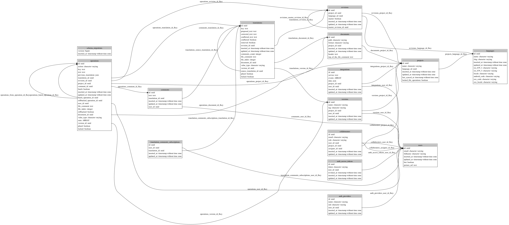

# Collection of PostgreSQL utilities

Some scripts that I have written during my work with PostgreSQL.

## `pg_graph`

Create [Graphviz's][gv] DOT file describing whole database.  Can be seen as poor
man's ERD generator for existing DBs.

### Usage

```
$ pg_graph <db_name> | dot -Tsvg > out.svg
```

Example output (generated for [Accent][accent] translation tool):



## License

See [`LICENSE`](LICENSE) file.

[gv]: https://www.graphviz.org
[accent]: https://github.com/mirego/accent
